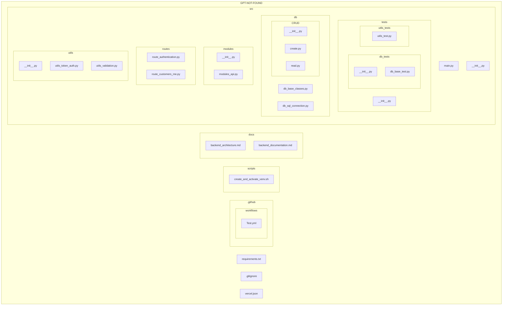

# 📌 Backend Architecture - GPT-NOT-FOUND

## 📖 Overview
This document provides a detailed explanation of the **GPT-NOT-FOUND** backend architecture. It covers the directory structure, the purpose of each folder and file, and how the project is organized. The goal is to ensure clarity and maintainability for developers working on the project.

This backend is built using **FastAPI** and follows a modular structure to enhance scalability and maintainability. It includes robust testing, API routing, authentication, and database management.

---

## Index
- [Project Structure](#project-structure)
- [Folder & File Descriptions](#folder--file-descriptions)
  - [`.github`](#github)
  - [`docs`](#docs)
  - [`scripts`](#scripts)
  - [`src`](#src)
    - [`db`](#db)
    - [`modules`](#modules)
    - [`routes`](#routes)
    - [`tests`](#tests)
    - [`utils`](#utils)
- [Additional Configuration Files](#additional-configuration-files)

## Project Structure

The backend is structured as follows:

## Folder & File Descriptions

### `.github`
This folder contains **GitHub Actions workflows** for CI/CD automation.

- **`workflows/Tests.yml`** → Defines automated test execution on GitHub Actions.

---

### `docs`
This folder stores documentation related to the backend.

- **`backend_architecture.md`** → Describes the project’s folder structure and purpose of each component.
- **`backend_documentation.md`** → Contains detailed API documentation and guidelines.

---

### `scripts`
This folder contains shell scripts used for automation.

- **`create_and_activate_venv.sh`** → Automates the creation and activation of a virtual environment for development.

---

### `src`
The core of the backend application, where all logic is implemented.

#### `db`
Handles database connections and interactions.

- **`db_base_classes.py`** → Defines base classes for the database models.
- **`db_sql_connection.py`** → Manages the connection to the database.
- **`CRUD/`** → Contains fundamental database operations:
  - **`create.py`** → Handles the creation of records.
  - **`read.py`** → Handles reading and fetching records.
  - **`__init__.py`** → Initializes the CRUD module.

---

#### `modules`
Contains modular functionalities that extend the backend.

- **`modules_api.py`** → Defines reusable API components and logic.
- **`__init__.py`** → Initializes the modules package.

---

#### `routes`
Defines all API endpoints for the application.

- **`route_authentication.py`** → Handles user authentication (login, JWT verification, etc.).
- **`route_customers_me.py`** → Handles customer-related API endpoints.

---

#### `tests`
Contains unit tests and integration tests to validate the system’s functionality.

- **`__init__.py`** → Initializes the test suite.
  
##### `db_tests`
Tests related to the database.

- **`__init__.py`** → Initializes the database test suite.
- **`db_base_test.py`** → Tests database operations.

##### `utils_tests`
Tests for utility functions.

- **`utils_test.py`** → Validates helper functions used throughout the project.

---

#### `utils`
Contains helper functions and utilities for authentication and validation.

- **`utils_token_auth.py`** → Handles JWT authentication and token management.
- **`utils_validation.py`** → Contains input validation functions.
- **`__init__.py`** → Initializes the utilities package.

---

## Additional Configuration Files

These files are located in the root directory of the project.

- **`requirements.txt`** → Lists all dependencies required for the project.
- **`.gitignore`** → Specifies files and folders to be ignored by Git.
- **`vercel.json`** → Configuration file for deploying the backend on Vercel.

---