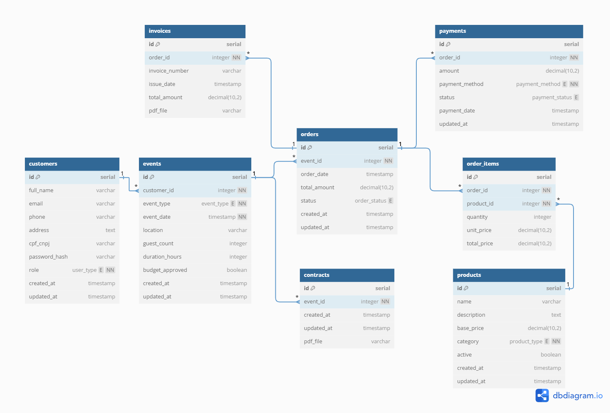

# 📌 Backend Proposal - Elo Drinks

## 📖 Overview
This document details the database structure, table relationships, and API routes for the **Elo Drinks** application. The goal is to create an efficient system to manage events, orders, customers, payments, and invoices.

---

## 📊 Database Structure

Below is the complete structure of the tables and their relationships.

### **1. Customers (`customers`)**
Stores information about customers and administrators.

| Field          | Type              | Description |
|---------------|------------------|-----------|
| `id`         | SERIAL PRIMARY KEY | Unique customer identifier |
| `full_name`  | VARCHAR(255) NOT NULL | Full name of the customer |
| `email`      | VARCHAR(255) UNIQUE NOT NULL | Customer email (used for login) |
| `phone`      | VARCHAR(30) | Contact phone number |
| `address`    | TEXT | Full address |
| `cpf_cnpj`   | VARCHAR(30) UNIQUE NOT NULL | Customer's document number |
| `password_hash` | VARCHAR(255) NOT NULL | Encrypted password (using bcrypt) |
| `role`       | user_type DEFAULT 'customer' NOT NULL | Indicates if the user is a customer or an admin |
| `created_at` | TIMESTAMP DEFAULT NOW() | Record creation timestamp |
| `updated_at` | TIMESTAMP DEFAULT NOW() | Last update timestamp |

📌 **Relationships:**  
- *1:N* → **Events (`events`)** → A customer can create multiple events.  

---

### **2. Events (`events`)**
Represents events organized by customers.

| Field          | Type        | Description |
|---------------|------------|-----------|
| `id`         | SERIAL PRIMARY KEY | Unique event identifier |
| `customer_id`| INT NOT NULL | Customer who created the event |
| `event_type` | event_type NOT NULL | Type of event (`wedding`, `corporate`, `debutante`, `other`) |
| `event_date` | TIMESTAMP NOT NULL | Date of the event |
| `location`   | VARCHAR(255) NOT NULL | Event location |
| `guest_count`| INT NOT NULL | Number of guests |
| `duration_hours` | INT NOT NULL | Event duration in hours |
| `budget_approved` | BOOLEAN DEFAULT FALSE | Indicates whether the budget was approved |
| `created_at` | TIMESTAMP DEFAULT NOW() | Record creation timestamp |
| `updated_at` | TIMESTAMP DEFAULT NOW() | Last update timestamp |

📌 **Relationships:**  
- *1:N* → **Orders (`orders`)** → An event can have multiple orders.  
- *1:1* → **Contracts (`contracts`)** → Each event can have an associated contract.

---

### **3. Orders (`orders`)**
Represents service and product orders for an event.

| Field         | Type         | Description |
|--------------|-------------|-----------|
| `id`        | SERIAL PRIMARY KEY | Unique order identifier |
| `event_id`  | INT NOT NULL | Related event |
| `order_date`| TIMESTAMP DEFAULT NOW() | Order date |
| `total_amount` | DECIMAL(10,2) NOT NULL | Total order value |
| `status`    | order_status DEFAULT 'pending' NOT NULL | Order status (`pending`, `paid`, `canceled`) |
| `created_at` | TIMESTAMP DEFAULT NOW() | Record creation timestamp |
| `updated_at` | TIMESTAMP DEFAULT NOW() | Last update timestamp |

📌 **Relationships:**  
- *1:N* → **Order Items (`order_items`)** → An order can contain multiple products.  
- *1:1* → **Payments (`payments`)** → Each order has a payment.  
- *1:1* → **Invoices (`invoices`)** → Each order generates an invoice.

---

### **4. Order Items (`order_items`)**
Products and services added to an order.

| Field       | Type         | Description |
|------------|-------------|-----------|
| `id`       | SERIAL PRIMARY KEY | Unique item identifier |
| `order_id` | INT NOT NULL | Order to which the item belongs |
| `product_id` | INT NOT NULL | Referenced product |
| `quantity` | INT NOT NULL | Requested product quantity |
| `unit_price` | DECIMAL(10,2) NOT NULL | Price per unit |
| `total_price` | DECIMAL(10,2) NOT NULL | Total item price |

📌 **Relationships:**  
- *N:M* → **Products (`products`)** → A product can appear in multiple orders.

---

### **5. Products (`products`)**
Drinks, services, and items available for sale.

| Field       | Type        | Description |
|------------|------------|-----------|
| `id`       | SERIAL PRIMARY KEY | Unique product identifier |
| `name`     | VARCHAR(255) NOT NULL | Product name |
| `description` | TEXT | Product description |
| `base_price` | DECIMAL(10,2) NOT NULL | Base product price |
| `category` | product_type NOT NULL | Item category (`drink`, `structure`, `service`) |
| `active`   | BOOLEAN DEFAULT TRUE | Indicates whether the product is available for sale |
| `created_at` | TIMESTAMP DEFAULT NOW() | Record creation timestamp |
| `updated_at` | TIMESTAMP DEFAULT NOW() | Last update timestamp |

📌 **Relationships:**  
- *N:M* → **Orders (`order_items`)** → A product can appear in multiple orders.

---

### **6. Payments (`payments`)**
Records order payments.

| Field         | Type        | Description |
|--------------|------------|-----------|
| `id`        | SERIAL PRIMARY KEY | Unique payment identifier |
| `order_id`  | INT NOT NULL | Paid order |
| `amount`    | DECIMAL(10,2) NOT NULL | Paid amount |
| `payment_method` | payment_method NOT NULL | Payment method (`credit_card`, `pix`, `boleto`, `bank_transfer`) |
| `status`    | payment_status DEFAULT 'pending' NOT NULL | Payment status (`pending`, `approved`, `rejected`) |
| `payment_date` | TIMESTAMP | Payment date |
| `updated_at` | TIMESTAMP DEFAULT NOW() | Last update timestamp |

---

### **7. Invoices (`invoices`)**
Stores order invoices.

| Field         | Type        | Description |
|--------------|------------|-----------|
| `id`        | SERIAL PRIMARY KEY | Unique invoice identifier |
| `order_id`  | INT NOT NULL | Related order |
| `invoice_number` | VARCHAR(50) UNIQUE NOT NULL | Invoice number |
| `issue_date` | TIMESTAMP NOT NULL | Issue date |
| `total_amount` | DECIMAL(10,2) NOT NULL | Total invoice value |
| `pdf_file`  | VARCHAR(255) | File path for PDF invoice |

---

### **8. Contracts (`contracts`)**
Contract generated for the company's and customer’s protection.

| Field         | Type        | Description |
|--------------|------------|-----------|
| `id`        | SERIAL PRIMARY KEY | Unique contract identifier |
| `event_id`  | INT NOT NULL | Related event |
| `created_at` | TIMESTAMP DEFAULT NOW() | Record creation timestamp |
| `updated_at` | TIMESTAMP DEFAULT NOW() | Last update timestamp |
| `pdf_file`  | VARCHAR(255) | File path for PDF contract |

---

## 🔹 API Routes Overview

| Route | Method | Path                                       | Implemented | Tested |
|-|--------|--------------------------------------------|-------------|--------|
|**Authentication**| | | | |
| | POST   | /auth/register                             | ✅          | ✅     |
| | POST   | /auth/login                                | ✅          | ✅     |
| | GET    | /customers/me                              | ✅          | ✅     |
|**Customers**| | | |
| | GET    | /customers                                 | ✅          | ✅     |
| | POST   | /customers                                 | ✅          | ✅     |
| | GET    | /customers?customers_id={id}               | ✅          | ✅     |
| | PUT    | /customers?customers_id={id}               | ✅          | ✅     |
| | DELETE | /customers?customers_id={id}               | ✅          | ✅     |
|**Events**| | | |
| | GET    | /events                                    | ✅          | ✅     |
| | POST   | /events                                    | ✅          | ✅     |
| | GET    | /events?event_id={id}                      | ✅          | ✅     |
| | PUT    | /events?event_id={id}                      | ✅          | ✅     |
| | DELETE | /events?event_id={id}                      | ✅          | ✅     |
|**Orders**| | | |
| | GET    | /orders                                    | ✅          | ✅     |
| | POST   | /orders                                    | ✅          | ✅     |
| | GET    | /orders?order_id={id}                      | ✅          | ✅     |
| | PUT    | /orders?order_id={id}                      | ✅          | ✅     |
| | DELETE | /orders?order_id={id}                      | ✅          | ✅     |
|**Products**| | | |
| | GET    | /products                                  | ✅          | ✅     |
| | POST   | /products                                  | ✅          | ✅     |
| | GET    | /products?product_id={id}                  | ✅          | ✅     |
| | PUT    | /products?product_id={id}                  | ✅          | ✅     |
| | DELETE | /products?product_id={id}                  | ✅          | ✅     |
|**Payments**| | | |
| | POST   | /payments                                  | ✅          | ✅     |
| | GET    | /payments?payments_id={id}                 | ✅          | ✅     |
| | PUT    | /payments?payments_id={id}                 | ✅          | ✅     |
|**Invoices**| | | |
| | GET    | /invoices?event_id={id}                    | ✅          | ✅     |
| | GET    | /invoices/download?invoice_id={id}         | ✅          | ✅     |
|**Contracts**| | | |
| | POST   | /contracts                                 | ✅          | ✅     |
| | GET    | /contracts?event_id={id}                   | ✅          | ✅     |
| | GET    | /contracts/download?contract_id={id}       | ✅          | ✅     |
|**Order items**| | | |
| | GET    | /order_items                               | ✅          | ❌     |
| | POST   | /order_items                               | ✅          | ❌     |
| | GET    | /order_items?order_items={id}              | ✅          | ❌     |
| | PUT    | /order_items?order_items={id}              | ✅          | ❌     |
| | DELETE | /order_items?order_items={id}              | ✅          | ❌     |
|**Customer data**| | | |
| | GET    | /customers/{customer_id}/events            | ✅          | ✅     |
| | GET    | /customers/{customer_id}/orders            | ✅          | ✅     |
| | GET    | /customers/{customer_id}/payments          | ✅          | ✅     |
| | GET    | /customers/{customer_id}/invoices          | ✅          | ✅     |
| | GET    | /customers/{customer_id}/contracts         | ✅          | ✅     |
| | GET    | /customers/{customer_id}/order_items       | ✅          | ❌     |
